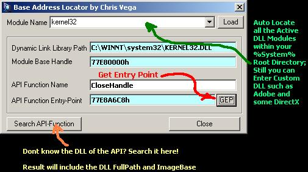



## Base Address Locator for DLL Modules and its API Functions

### Description

Dynamic Link Library are located on certain space within your windows system; locating where they are always included on advanced programmers tasklist; This includes the Virtual Space of every exported API-Functions. Now, you might ask me whats the use of it, well in C++ and Win32 Assembly, we are able to call the API-Functions directly without *Importing* it to the Executable, making our code Smaller and Faster (Direct Calling) In which I am trying to achieve here using Visual Basic; If somehow you know how to directly Call/Access API-Functions using Memory Address, please drop me an email; thanks.
 
### More Info
 

             |
---                |---
**Submitted On**   |2001-04-10 17:24:32
**By**             |[Chris Vega](https://github.com/Planet-Source-Code/PSCIndex/blob/master/ByAuthor/chris-vega.md)
**Level**          |Advanced
**User Rating**    |4.6 (23 globes from 5 users)
**Compatibility**  |VB 5\.0, VB 6\.0
**Category**       |[Miscellaneous](https://github.com/Planet-Source-Code/PSCIndex/blob/master/ByCategory/miscellaneous__1-1.md)
**World**          |[Visual Basic](https://github.com/Planet-Source-Code/PSCIndex/blob/master/ByWorld/visual-basic.md)
**Archive File**   |[Base Addre181654102001\.zip](https://github.com/Planet-Source-Code/chris-vega-base-address-locator-for-dll-modules-and-its-api-functions__1-22269/archive/master.zip)

